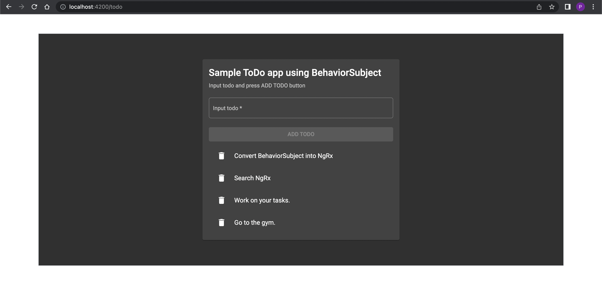

# What is this?

This is a sample demo todo app using `BehaviorSubject` as a simple approach to handle the state management in Angular. This follows the tutorial [Why you *should* use NgRx if you're learning Angular](https://www.youtube.com/watch?v=B3KJvoyQUdE).

**NOTE:** This app is created to show the Angular dev how we go from `BehaviorSubject` approach into `NgRx` approach to handle the state management in Angular. So this app will be refactored using `NgRx` lib to handle the state management instead of `BehaviorSubject.`. For the app that uses `NgRx` lib, please check out [I bet you can understand NgRx after watching this video](https://www.youtube.com/watch?v=kx0VTgTtSBg), and [its source code](https://github.com/tuanbs/sample-todo-app-using-ngrx).

# How to make this app up and running?

Clone this app with git command. -> Then open the app's root and run `npm install` to install the npm packages. -> Then run `npm run start` or `ng serve` to trigger the app. -> Then open your browser to with address `localhost:4200`.

